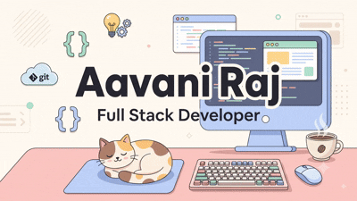

  

<h1 align="center">🌸 Hi there, I'm Aavani! ✨</h1>
<h3 align="center">Aspiring Full Stack Developer & Exponential Learner 🌱</h3>

  Welcome to my cozy corner of GitHub! 🎀 I'm a super enthusiastic beginner who is incredibly excited about technology. I identify as an <strong>exponential learner</strong>—I might be just starting out, but I'm ready to learn fast and grow exponentially! My official full-stack classes haven't even started yet, but I couldn't wait to dive in, get my hands dirty, and get a head start. Let's build something beautiful together! 🌷

  
  

---

## 🎀 About Me ✨

| 🌷 **Who I Am** | 🌟 **My Journey** |
| :--- | :--- |
| 🌱 **Name:** Aavani Raj 🎓 **Status:** Eager Beginner 💖 **Mindset:** Exponential Learner | 📚 Getting a head start before my full-stack classes officially begin! 🚀 Passionate about writing clean, logical code. 🎯 Goal: To master the frontend and backend to build full web apps! |

 

## 💻 My Skills (So far!) 🌸

| 🛠️ **Technical Foundations** | 🗣️ **Soft Skills & Beyond** |
| :--- | :--- |
| 🔹 **Languages:** C, Python 🔹 **Logic:** Data Structures & Algorithms (DSA) 🔹 **Web Dev Basics:** Just getting started with the fundamentals! ✨ | 💬 **Communication:** I love talking about tech and breaking down ideas. 🤝 **Teamwork:** Always ready to collaborate and help out. 📈 **Adaptability:** Ready to absorb new concepts like a sponge! |

 

## 📊 My GitHub Journey 🦋

  <i>Just starting my coding journey! Watch this space for my future projects and contributions as I begin my full-stack classes. 🌱✨</i>

